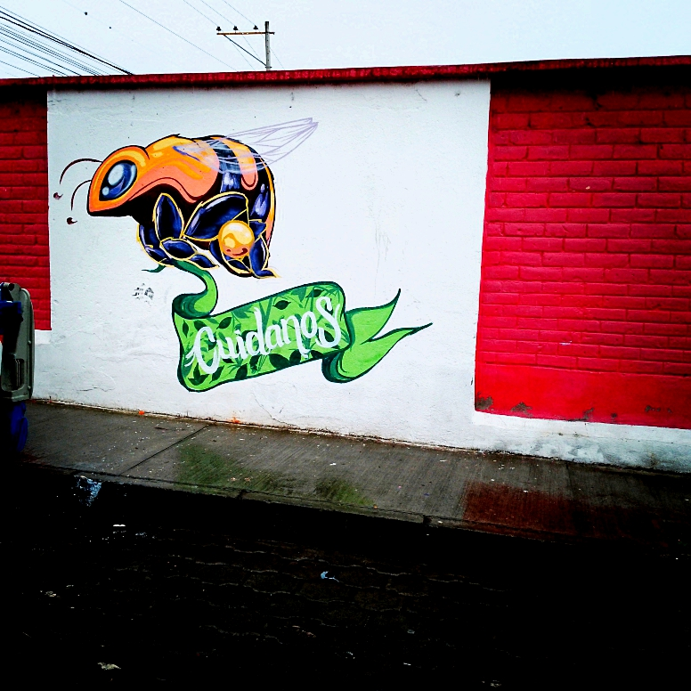
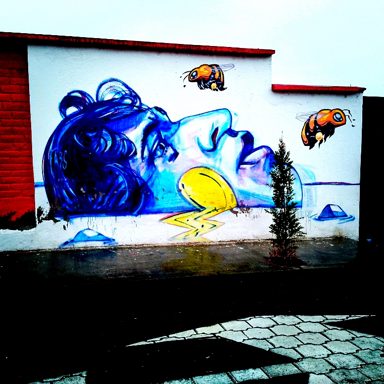
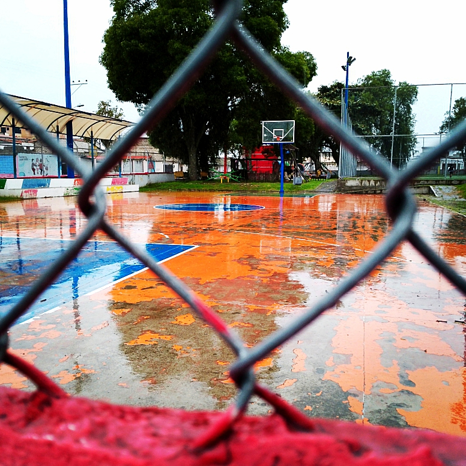
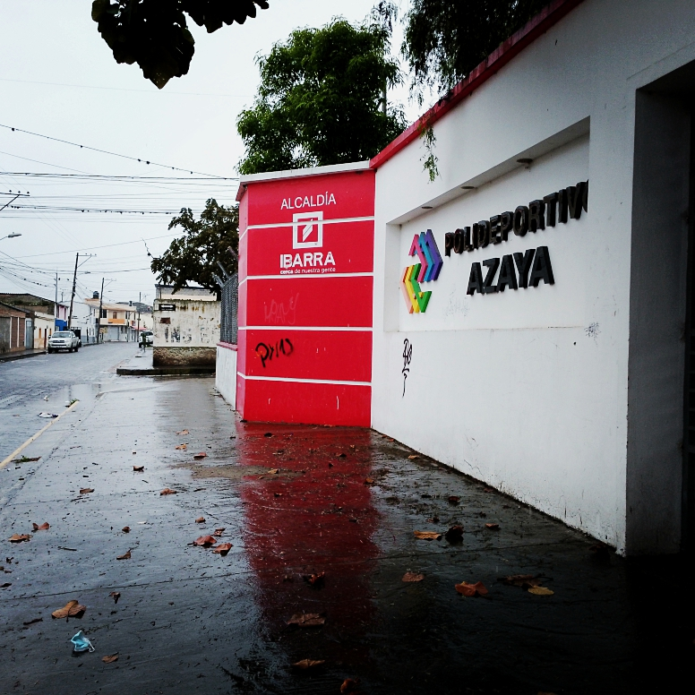

# Informe Visual con Imágenes

## Sección 1

Titulo: Unpedazo de Azaya

## Sección 2

Resumen grafico de algunos murales que se encuentran a las afueras de una insti. educativa.

## Galería de Imágenes

  
  
  
  
  
  
  
  
  
  
  

<!-- Puedes agregar más imágenes según sea necesario -->

## Conclusión

Iniciar y cambiar...

